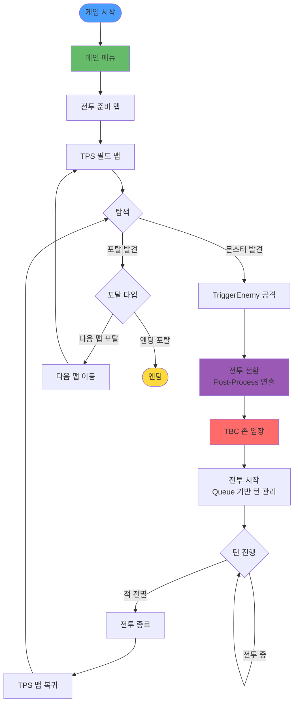
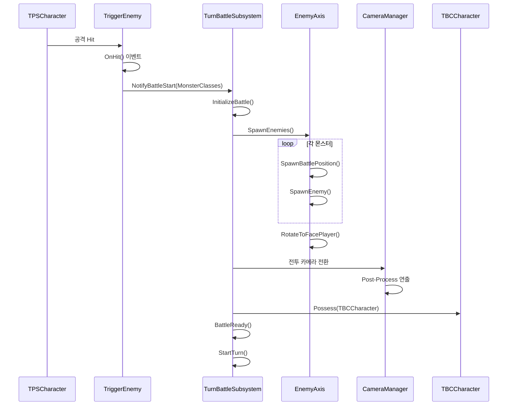
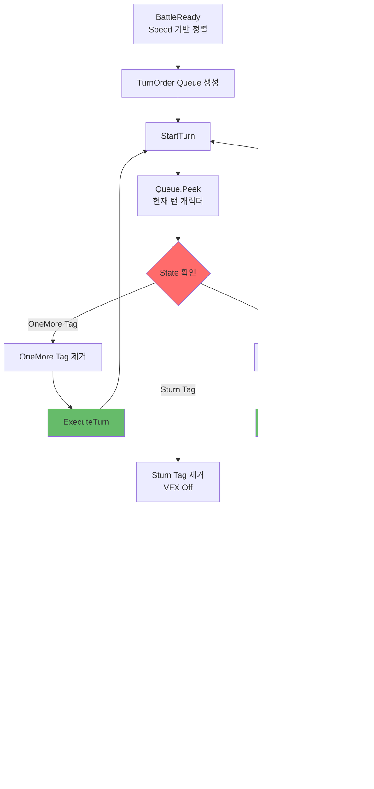
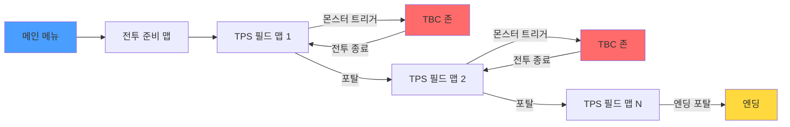
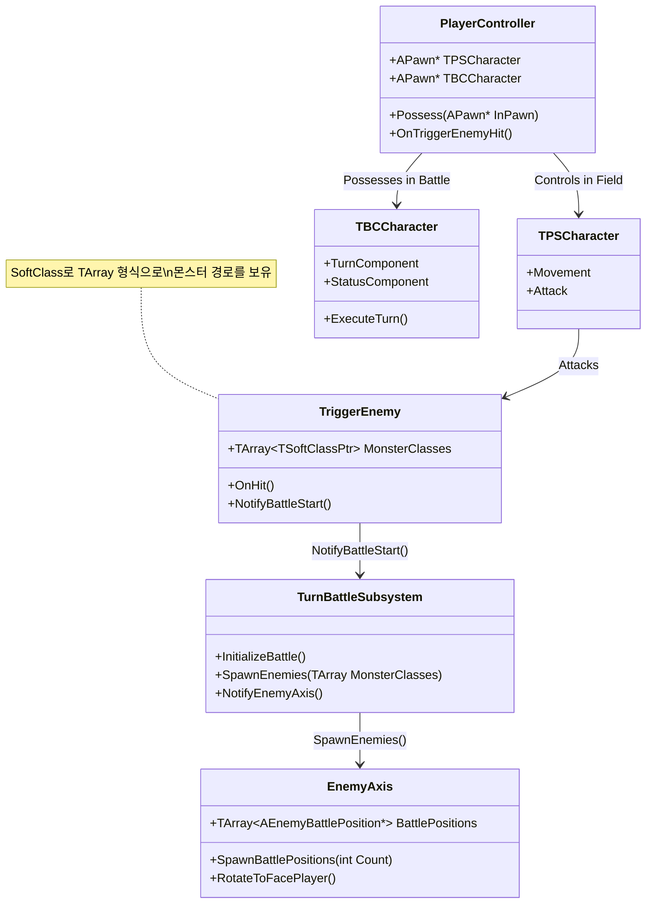
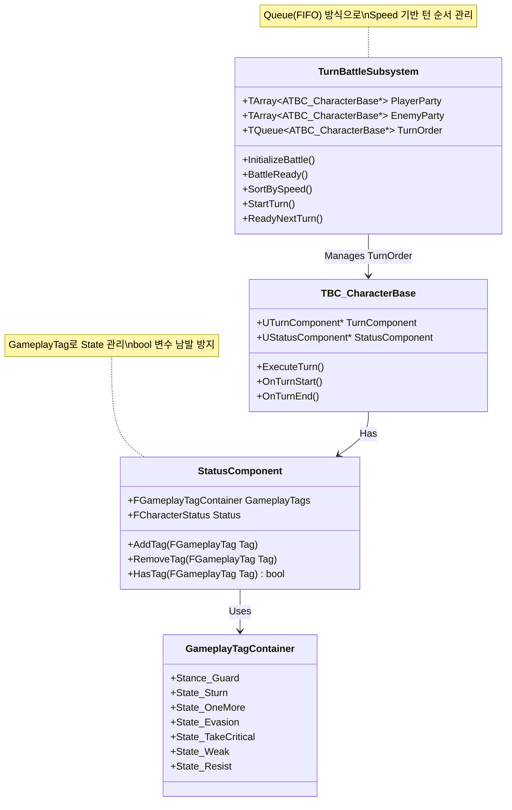
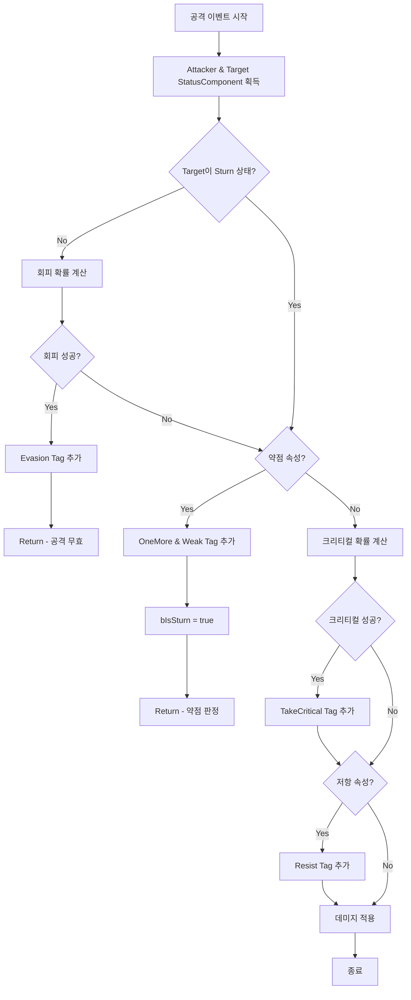

# Persona 3 Reload - Turn-Based JRPG Portfolio

##  목차 (Table of Contents)

- [프로젝트 개요](#-프로젝트-개요)
  - [개발 동기 및 목표](#개발-동기-및-목표)
- [게임 진행 흐름](#-게임-진행-흐름)
- [주요 역할 및 성과](#-주요-역할-및-성과)
- [시스템 아키텍처](#️-시스템-아키텍처)
  - [1. TriggerEnemy → TBC Possess 시스템](#1-triggerenemy--tbc-possess-시스템)
  - [2. Turn-Based Combat System](#2-turn-based-combat-system)
  - [3. Battle System](#3-battle-system)
  - [4. Post-Processing System](#4-post-processing-system)
- [핵심 구현 내용 상세](#-핵심-구현-내용-상세)
- [기술 스택 및 패턴](#-기술-스택-및-패턴)
- [성능 최적화](#-성능-최적화)
- [코드 구조](#-코드-구조)
- [향후 개선 방향](#-향후-개선-방향)
- [학습 및 성장](#-학습-및-성장)

---

##  프로젝트 개요

**프로젝트명**: Persona 3 Reload  
**엔진**: Unreal Engine 5.4  
**장르**: Turn-Based JRPG  
**담당 파트**: 프레임워크 설계, 전투 시스템, 턴제 시스템, AI, 카메라, 시퀀스, 캐릭터, 몬스터, 스킬시스템

**개발 기간**: [2025.06.27 ~ 2025.07.31]  
**개발 인원**: 팀장 - 신승현 팀원 - 장용석,홍성윤 총 3명

페르소나 3 리로드(2024)의 아트 리소스를 활용하여 Unreal C++로 제작한 턴제 전투 시스템 프로젝트입니다.

### 개발 동기 및 목표

#### 배경
턴제간 **속성 및 State 관리**를 통해 자료구조 능력과 **확장성 있는 설계 능력**을 키우고, 레벨 시퀀스, 전투 카메라, Turn-Based 시스템을 심도 있게 학습하고자 선정했습니다.

#### 핵심 목표
1. **확장 가능한 턴제 시스템 구축**
   - Queue 기반 턴 순서 관리
   - GameplayTag를 활용한 유연한 State 관리
   - Component 기반 모듈화 설계

2. **복잡한 전투 메커니즘 구현**
   - 속성 시스템 (약점, 저항, 크리티컬)
   - 다양한 State 관리 (스턴, 회피, 가드 등)
   - 연속 턴 시스템 (OneMore)

3. **영화적 연출 시스템**
   - Level Sequence 동적 바인딩
   - 상황별 카메라 전환
   - Post-Process를 활용한 전투 입장 연출

#### 개발 동기
가장 인생 게임이라고 할 수 있는 **33원정대**, **발더스게이트3**와 같은 턴제 게임을 직접 제작해 보고 싶다는 열정으로 시작한 프로젝트입니다.

---

##  게임 진행 흐름

### 전체 게임 플로우



### 전투 진입 상세 플로우



### 턴 진행 상세 플로우



### 맵 전환 구조



---

##  주요 역할 및 성과

### 시스템 아키텍처 설계
- **Subsystem 패턴** 기반 턴제 전투 시스템 구축
- **Component 기반 설계**로 기능 분리 및 재사용성 향상
- **GameplayTag 기반 State 관리** 시스템 구현
- **이벤트 기반 아키텍처**로 결합도 감소

### 핵심 시스템 구현
- ✅ 프레임워크 설계 및 메인 로직 구현
- ✅ TPS ↔ TBC 캐릭터 전환 시스템
- ✅ 턴제 전투 시스템 (Queue 기반)
- ✅ 몬스터 스폰 및 배치 시스템
- ✅ 타겟팅 시스템
- ✅ 스킬 시스템 (UObject 기반)
- ✅ AI 시스템
- ✅ 동적 카메라 시스템
- ✅ Level Sequence 통합
- ✅ Post-Process 전투 입장 연출
- ✅ 사운드 매니저

### 기술적 성과
- **Queue(FIFO) 자료구조**: 효율적인 턴 순서 관리
- **GameplayTag 시스템**: bool 변수 남발 방지 및 확장성 확보
- **동적 시퀀스 바인딩**: 캐릭터별 유연한 시퀀스 재생
- **Custom Stencil**: 전투 입장 시각 효과 구현

---

##  시스템 아키텍처

### 1. TriggerEnemy → TBC Possess 시스템

#### 시스템 개요
일반 필드에서 전투 필드로의 매끄러운 전환을 위한 시스템입니다. TPS(Third Person Shooter) 캐릭터와 TBC(Turn-Based Combat) 캐릭터를 분리하여 관리합니다.

#### 클래스 다이어그램



---

### 2. Turn-Based Combat System

#### 클래스 다이어그램



---

### 3. Battle System

#### 상태 계산 우선순위
1. **회피 (Evasion)**: 스턴 상태가 아닐 때 확률적으로 발동
2. **약점 (Weak)**: 속성 약점 공격 시 OneMore 부여 및 스턴
3. **크리티컬 (Critical)**: 확률적으로 발동, 저항과 중복 가능
4. **저항 (Resist)**: 속성 저항 시 데미지 감소

#### 전투 상태 계산 흐름



---

### 4. Post-Processing System

**커스텀 스텐실**을 이용한 전투 입장 연출:
- **CustomDepth** 기반 메쉬 색상 분리
- 스크린 좌표 기반 **마름모 마스크** 생성
- **Material Parameter Collection**으로 동적 크기 제어

---

##  핵심 구현 내용 상세

### 1. 필드-전투 전환 시스템

TPS 캐릭터와 TBC 캐릭터를 분리 관리하며, TriggerEnemy 타격 시 전투 필드의 투명 Pawn에 Possess합니다.

```cpp
void AMyPlayerController::TransitionToBattle() {
    if (TBCCharacter) {
        Possess(TBCCharacter);
        CameraManager->SetTargetView("BattleCamera");
    }
}
```

### 2. 몬스터 스폰 시스템

**Attach 계층 구조**: EnemyAxis → EnemyBattlePosition → Enemy

```cpp
void AEnemyAxis::SpawnBattlePositions(int32 Count) {
    for (int32 i = 0; i < Count; ++i) {
        FVector Location = CalculatePositionLocation(i, Count);
        AEnemyBattlePosition* Position = GetWorld()->SpawnActor<AEnemyBattlePosition>(
            BattlePositionClass, Location, FRotator::ZeroRotator
        );
        Position->AttachToActor(this, FAttachmentTransformRules::KeepWorldTransform);
        BattlePositions.Add(Position);
    }
}
```

### 3. 턴 관리 시스템

Queue(FIFO) 기반 턴 순서 관리:

```cpp
void UTurnBattleSubsystem::BattleReady() {
    TArray<ATBC_CharacterBase*> AllCharacters;
    AllCharacters.Append(PlayerParty);
    AllCharacters.Append(EnemyParty);
    
    AllCharacters.Sort([](const ATBC_CharacterBase& A, const ATBC_CharacterBase& B) {
        return A.TurnComponent->Speed > B.TurnComponent->Speed;
    });
    
    TurnOrder.Empty();
    for (auto* Character : AllCharacters) {
        TurnOrder.Enqueue(Character);
    }
    
    StartTurn();
}
```

### 4. State 관리 시스템

GameplayTag 기반 State 관리로 bool 변수 남발 방지:

```cpp
// Sturn 상태 처리
if (Owner->StatusComponent->Get_GameTag().HasTag(FGameplayTag::RequestGameplayTag("State.Sturn")))
{
    Owner->StatusComponent->Get_GameTag().RemoveTag(FGameplayTag::RequestGameplayTag("State.Sturn"));
    Owner->StatusComponent->SturnVfx_Off();
}
```

---

##  기술 스택 및 패턴

### 사용 기술
- **Unreal Engine 5.4**
- **C++**: 모든 베이스 시스템 구현
- **Gameplay Tags**: State 및 UI 관리
- **Level Sequence**: 영화적 연출
- **Material Parameter Collection**: 동적 머티리얼 제어
- **Custom Stencil**: 포스트 프로세스 효과

### 디자인 패턴
- **Subsystem Pattern**: 게임 인스턴스 레벨의 턴 관리
- **Component Pattern**: 기능별 컴포넌트 분리
- **Observer Pattern**: GameplayTag 변경 시 자동 알림
- **Queue (FIFO)**: 턴 순서 관리
- **Event-Driven Architecture**: 이벤트 기반 턴 진행

---

##  성능 최적화

### 메모리 관리
- **TSoftClassPtr 활용**: 몬스터 클래스 지연 로딩
- **Component 기반 설계**: 필요한 기능만 Attach
- **GameplayTag 사용**: bool 변수 남발 방지

### 로직 최적화
- **Queue 자료구조**: O(1) 시간 복잡도로 턴 순서 관리
- **이벤트 기반 아키텍처**: Tick 의존성 최소화
- **상태 사전 계산**: 공격 전 모든 상태 계산으로 중복 연산 방지

---

##  코드 구조

```
Source/Persona3Reroad/
├── Public/
│   ├── Subsystem/
│   │   └── TurnBattleSubsystem.h
│   ├── Character/
│   │   ├── TPSCharacter.h
│   │   ├── TBC_CharacterBase.h
│   │   ├── PlayerCharacter.h
│   │   └── EnemyCharacter.h
│   ├── Component/
│   │   ├── TurnComponent.h
│   │   └── StatusComponent.h
│   ├── Battle/
│   │   ├── TriggerEnemy.h
│   │   ├── EnemyAxis.h
│   │   └── EnemyBattlePosition.h
│   └── GameplayTags/
│       └── PersonaGameplayTags.h
└── Private/
```

---

##  향후 개선 방향

- [ ] 아이템 및 장비 시스템
- [ ] 세이브/로드 시스템

---

##  학습 및 성장

### 습득한 기술
- **자료구조 활용**: Queue를 활용한 효율적인 턴 관리
- **GameplayTag 시스템**: 확장 가능한 State 관리 방법
- **Level Sequence**: 동적 바인딩 및 블렌딩 기법
- **Post-Process**: Custom Stencil을 활용한 시각 효과
- **Component 기반 설계**: 모듈화 및 재사용성 향상

### 해결한 과제
- **복잡한 State 관리**: GameplayTag로 bool 변수 남발 방지
- **턴 순서 관리**: Queue 자료구조로 효율적인 FIFO 구현
- **동적 시퀀스**: 캐릭터별 다른 연출을 하나의 시스템으로 통합
- **성능 최적화**: 이벤트 기반 아키텍처로 Tick 의존성 최소화

---

<div align="center">

*턴제 게임의 깊이 있는 시스템 설계와 구현*

</div>
