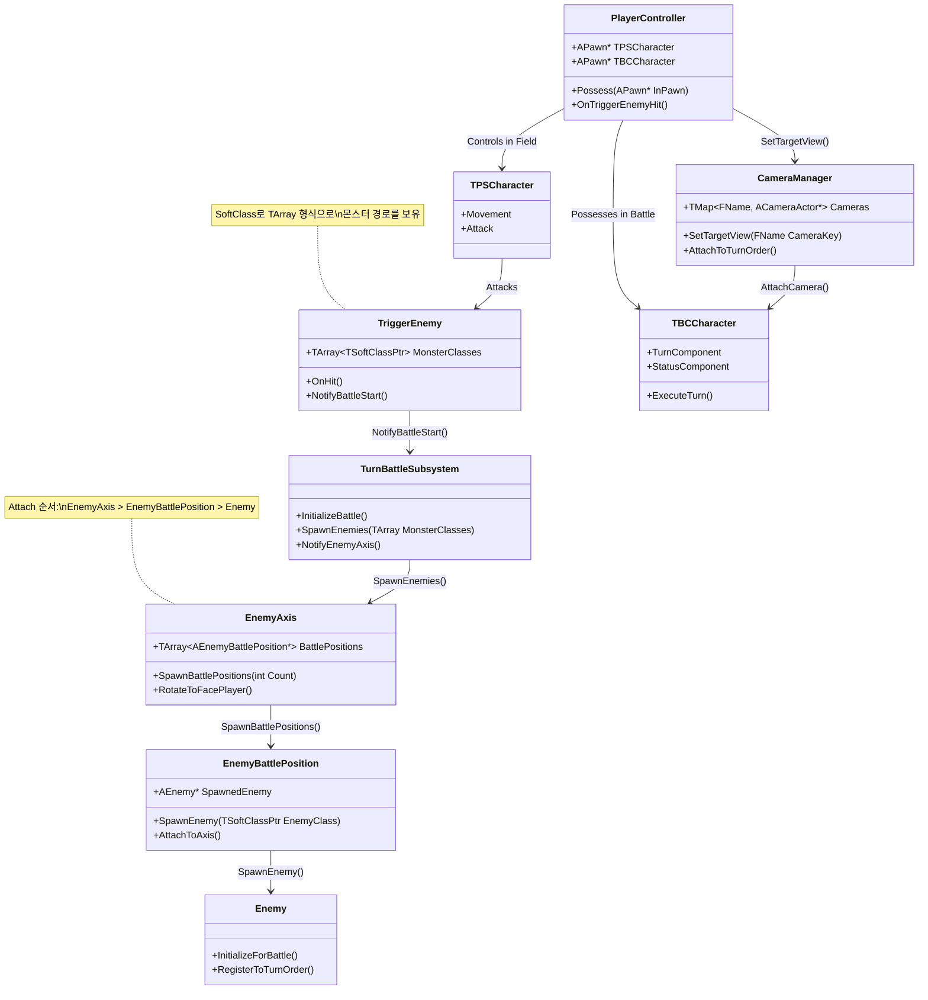
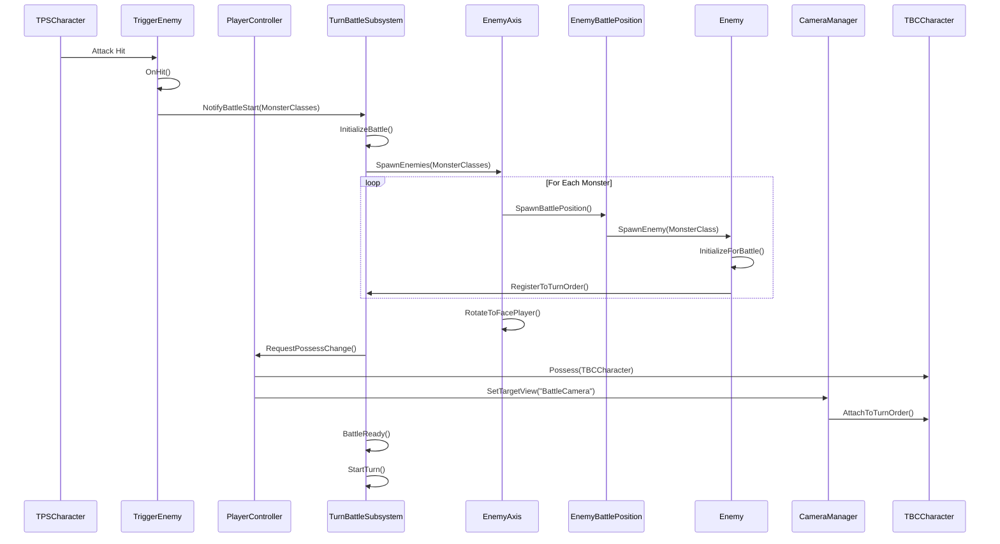
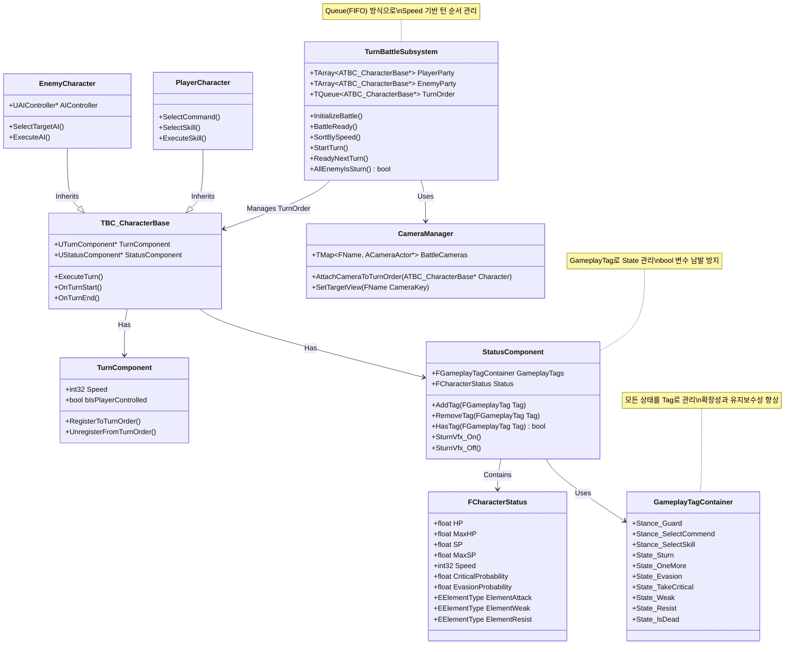
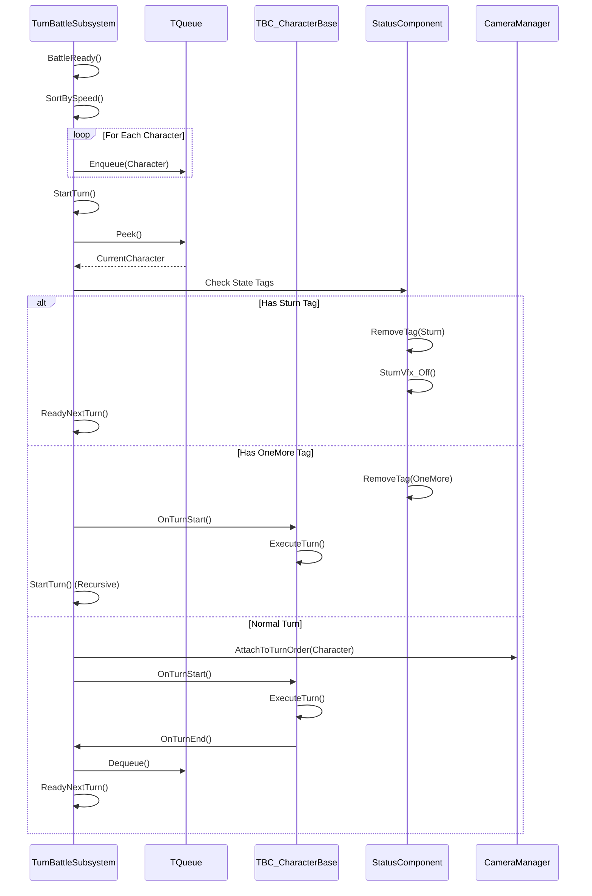
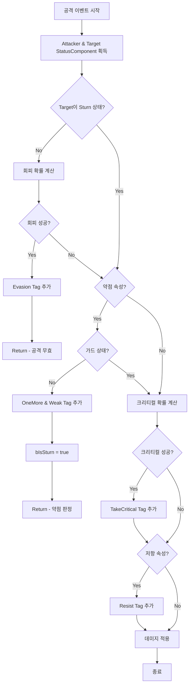

# Persona 3 Reload - Turn-Based JRPG Portfolio

## 📑 목차 (Table of Contents)

- [프로젝트 개요](#-프로젝트-개요)
  - [개발 동기 및 목표](#개발-동기-및-목표)
- [주요 역할 및 성과](#-주요-역할-및-성과)
- [시스템 아키텍처](#️-시스템-아키텍처)
  - [1. TriggerEnemy → TBC Possess 시스템](#1-triggerenemy--tbc-possess-시스템)
  - [2. Turn-Based Combat System](#2-turn-based-combat-system)
  - [3. Battle System](#3-battle-system)
  - [4. Post-Processing System](#4-post-processing-system)
- [핵심 구현 내용 상세](#-핵심-구현-내용-상세)
  - [1. 필드-전투 전환 시스템](#1-필드-전투-전환-시스템)
  - [2. 몬스터 스폰 시스템](#2-몬스터-스폰-시스템)
  - [3. 턴 관리 시스템](#3-턴-관리-시스템)
  - [4. State 관리 시스템](#4-state-관리-시스템)
  - [5. 전투 상태 계산 시스템](#5-전투-상태-계산-시스템)
  - [6. 카메라 관리 시스템](#6-카메라-관리-시스템)
  - [7. 스킬 시스템](#7-스킬-시스템)
  - [8. 동적 시퀀스 바인딩](#8-동적-시퀀스-바인딩)
  - [9. 전투 입장 포스트 프로세싱](#9-전투-입장-포스트-프로세싱)
- [기술 스택 및 패턴](#-기술-스택-및-패턴)
- [성능 최적화](#-성능-최적화)
- [코드 구조](#-코드-구조)
- [향후 개선 방향](#-향후-개선-방향)
- [학습 및 성장](#-학습-및-성장)

---

## 🎮 프로젝트 개요

**프로젝트명**: Persona 3 Reload  
**엔진**: Unreal Engine 5.4  
**장르**: Turn-Based JRPG  
**담당 파트**: 프레임워크 설계, 전투 시스템, 턴제 시스템, AI, 카메라, 시퀀스  
**개발 기간**: [개발 기간 입력]  
**개발 인원**: 팀장 - 신승현, 팀원 - 장용석,홍성윤 총 3명명

페르소나 3 리로드(2024)의 아트 리소스를 활용하여 Unreal C++로 제작한 턴제 전투 시스템 프로젝트입니다.

### 개발 동기 및 목표

#### 배경
턴제간 **속성 및 State 관리**를 통해 자료구조 능력과 **확장성 있는 설계 능력**을 키우고, 레벨 시퀀스, 전투 카메라, Turn-Based 시스템을 심도 있게 학습하고자 했습니다.

#### 핵심 목표
1. **확장 가능한 턴제 시스템 구축**
   - Queue 기반 턴 순서 관리
   - GameplayTag를 활용한 유연한 State 관리
   - Component 기반 모듈화 설계

2. **복잡한 전투 메커니즘 구현**
   - 속성 시스템 (약점, 저항, 크리티컬)
   - 다양한 State 관리 (스턴, 회피, 가드 등)
   - 연속 턴 시스템 (OneMore)

3. **영화적 연출 시스템**
   - Level Sequence 동적 바인딩
   - 상황별 카메라 전환
   - Post-Process를 활용한 전투 입장 연출

#### 개발 동기
가장 인생 게임이라고 할 수 있는 **33원정대**, **발더스게이트3**와 같은 턴제 게임을 직접 제작해 보고 싶다는 열정으로 시작한 프로젝트입니다. 단순한 기능 구현을 넘어 **전문적이고 확장 가능한 시스템 아키텍처**를 설계하는 것을 목표로 삼았습니다.

---

## 🏆 주요 역할 및 성과

### 시스템 아키텍처 설계
- **Subsystem 패턴** 기반 턴제 전투 시스템 구축
- **Component 기반 설계**로 기능 분리 및 재사용성 향상
- **GameplayTag 기반 State 관리** 시스템 구현
- **이벤트 기반 아키텍처**로 결합도 감소

### 핵심 시스템 구현
- ✅ 프레임워크 설계 및 메인 로직 구현
- ✅ TPS ↔ TBC 캐릭터 전환 시스템
- ✅ 턴제 전투 시스템 (Queue 기반)
- ✅ 몬스터 스폰 및 배치 시스템
- ✅ 타겟팅 시스템
- ✅ 스킬 시스템 (UObject 기반)
- ✅ AI 시스템
- ✅ 동적 카메라 시스템
- ✅ Level Sequence 통합
- ✅ Post-Process 전투 입장 연출
- ✅ 사운드 매니저

### 기술적 성과
- **Queue(FIFO) 자료구조**: 효율적인 턴 순서 관리
- **GameplayTag 시스템**: bool 변수 남발 방지 및 확장성 확보
- **동적 시퀀스 바인딩**: 캐릭터별 유연한 시퀀스 재생
- **Custom Stencil**: 전투 입장 시각 효과 구현

---

## 🏗️ 시스템 아키텍처

### 1. TriggerEnemy → TBC Possess 시스템

#### 시스템 개요
일반 필드에서 전투 필드로의 매끄러운 전환을 위한 시스템입니다. TPS(Third Person Shooter) 캐릭터와 TBC(Turn-Based Combat) 캐릭터를 분리하여 관리합니다.

#### 클래스 다이어그램



#### 전환 프로세스 시퀀스 다이어그램



---

### 2. Turn-Based Combat System

#### 시스템 개요
Speed 기반 Queue 자료구조를 활용한 턴 순서 관리 시스템입니다. GameplayTag를 통해 다양한 State를 효율적으로 관리합니다.

#### 클래스 다이어그램



#### 턴 진행 프로세스



---

### 3. Battle System

#### 시스템 개요
공격 전 상태 계산을 통해 회피, 약점, 크리티컬, 저항을 우선순위에 따라 처리하는 시스템입니다.

#### 상태 계산 우선순위
1. **회피 (Evasion)**: 스턴 상태가 아닐 때 확률적으로 발동
2. **약점 (Weak)**: 속성 약점 공격 시 OneMore 부여 및 스턴
3. **크리티컬 (Critical)**: 확률적으로 발동, 저항과 중복 가능
4. **저항 (Resist)**: 속성 저항 시 데미지 감소

#### 전투 상태 계산 흐름



---

### 4. Post-Processing System

#### 시스템 개요
Custom Stencil과 Material Parameter Collection을 활용한 전투 입장 연출 시스템입니다.

#### 구현 원리
1. **Custom Depth 설정**: 특정 메쉬에 CustomDepth 값 할당
2. **머티리얼 처리**: CustomDepth 값에 따라 색상 분리
3. **마름모 마스크**: 스크린 좌표 기반 마름모 생성
4. **동적 크기 조절**: MPC로 외부에서 크기 제어

---

## 📜 핵심 구현 내용 상세

### 1. 필드-전투 전환 시스템

#### 고려사항
- 어떤 식으로 일반 필드에서 전투 필드로 이동할 것인가?
- TPS 캐릭터와 TBC 캐릭터를 어떻게 분리 관리할 것인가?

#### 해결방안

필드맵에서 **TriggerEnemy**를 타격 시 전투 필드에 미리 배치해 놓은 투명 Pawn에 **Possess**합니다.

> **핵심 설계**: 내가 직접 TurnOrder를 Controller로 조작하는 것이 아니라 **이벤트를 호출해 TurnOrder가 액션을 취하는 방식**

**TPS(Third Person)** 캐릭터와 **TBC(Turn-Based)** 캐릭터를 분리해서 관리합니다.

#### 실행 화면

.gif)


#### 기술적 특징

```cpp
// PlayerController에서 Possess 전환
void AMyPlayerController::TransitionToBattle() {
    // TPS 캐릭터에서 TBC 캐릭터로 Possess 전환
    if (TBCCharacter) {
        Possess(TBCCharacter);
        
        // 카메라 전환
        CameraManager->SetTargetView("BattleCamera");
    }
}
```

---

### 2. 몬스터 스폰 시스템

#### 고려사항
- 몬스터 스폰을 어떤 식으로 다양하게 할 것인가?
- 배치 포인트의 무너짐 없이 어떻게 관리할 것인가?

#### 해결방안

**TriggerEnemy** → **TurnBattleSubSystem** → **EnemyAxis** → **EnemyBattlePosition** → **Enemy**

Trigger Enemy가 SoftClass로 TArray 형식으로 몬스터 경로를 들고 있다가 플레이어 공격에 Trigger 시 이벤트 호출을 통해 SubSystem을 통해 Enemy Axis에게 넘겨줍니다.

Enemy Axis가 Trigger Enemy의 TArray 길이만큼 Enemy BattlePosition을 Spawn한 뒤 EnemyBattlePosition이 Trigger Enemy에 있는 SoftClass 몬스터들을 Spawn합니다.

#### Attach 계층 구조
```
EnemyAxis (회전 축)
  └── EnemyBattlePosition (배치 포인트)
        └── Enemy (실제 몬스터)
```

이렇게 코드를 작성한 이유는 몬스터가 배치 포인트의 무너짐이 없이 **TurnOrder를 축을 통한 회전**으로 바라봐야 한다고 판단했습니다.

#### 구현 코드

```cpp
// TriggerEnemy에서 몬스터 클래스 보유
UPROPERTY(EditAnywhere, Category = "Spawn")
TArray<TSoftClassPtr<AEnemy>> MonsterClasses;

// EnemyAxis에서 배치 포인트 생성
void AEnemyAxis::SpawnBattlePositions(int32 Count) {
    for (int32 i = 0; i < Count; ++i) {
        FVector Location = CalculatePositionLocation(i, Count);
        AEnemyBattlePosition* Position = GetWorld()->SpawnActor<AEnemyBattlePosition>(
            BattlePositionClass, Location, FRotator::ZeroRotator
        );
        Position->AttachToActor(this, FAttachmentTransformRules::KeepWorldTransform);
        BattlePositions.Add(Position);
    }
}
```

---

### 3. 턴 관리 시스템

#### 고려사항
- 턴 관리를 어떤 식으로 할 것인가?
- 전역적으로 접근 가능하면서도 효율적인 구조는?

#### 해결방안

턴 관리는 모든 레벨에 거의 사용되니 **SubSystem**으로 전역적으로 관리할 `TurnBattleSubsystem`을 C++로 제작했습니다.

`TurnBaseCharacter`에 CDO인 `TurnComponent`를 통해 **PlayerParty**와 **EnemyParty** 배열을 만들었고, `BattleReady` 이벤트가 호출되면 **Speed 값으로 정렬**해 **Queue 형식**으로 TurnOrder를 관리했습니다.

> **설계 이유**: TurnOrder는 선입선출 **FIFO 방식인 Queue**가 더 유리하다고 판단했습니다.

#### 구현 코드

```cpp
void UTurnBattleSubsystem::BattleReady() {
    // 모든 캐릭터를 Speed 기준으로 정렬
    TArray<ATBC_CharacterBase*> AllCharacters;
    AllCharacters.Append(PlayerParty);
    AllCharacters.Append(EnemyParty);
    
    AllCharacters.Sort([](const ATBC_CharacterBase& A, const ATBC_CharacterBase& B) {
        return A.TurnComponent->Speed > B.TurnComponent->Speed;
    });
    
    // Queue에 삽입
    TurnOrder.Empty();
    for (auto* Character : AllCharacters) {
        TurnOrder.Enqueue(Character);
    }
    
    StartTurn();
}
```

---

### 4. State 관리 시스템

#### 고려사항
- State가 상당히 많고 특정 State에는 한 번 더 플레이할 수 있거나 턴이 넘어가야 하는데 어떻게 관리를 할 것인가?
- bool 변수가 많아지는 것을 어떻게 방지할 것인가?

#### 해결방안

TurnBase 최상위 클래스인 `TBC_CharacterBase`에 `StatusComponent`를 CDO하고, `StatusComponent`에서 각 상태들을 **GameplayTag**로 관리합니다.

> **장점**: bool 변수가 많아지지 않아서 편리했고 상태를 보다 편리하게 관리할 수 있었습니다.

#### GameplayTag 정의

```cpp
namespace PersonaGamePlayTags
{
    // Input Tags
    UE_DECLARE_GAMEPLAY_TAG_EXTERN(Input_Action_Move);
    UE_DECLARE_GAMEPLAY_TAG_EXTERN(Input_Action_CamMove);
    UE_DECLARE_GAMEPLAY_TAG_EXTERN(Input_Action_Sprint);
    UE_DECLARE_GAMEPLAY_TAG_EXTERN(Input_Action_Attack);

    // Stance Tags
    UE_DECLARE_GAMEPLAY_TAG_EXTERN(Stance_SelectCommend);
    UE_DECLARE_GAMEPLAY_TAG_EXTERN(Stance_SelectSkill);
    UE_DECLARE_GAMEPLAY_TAG_EXTERN(Stance_Guard);
    UE_DECLARE_GAMEPLAY_TAG_EXTERN(Stance_Summon);
    UE_DECLARE_GAMEPLAY_TAG_EXTERN(State_IsDead);
    UE_DECLARE_GAMEPLAY_TAG_EXTERN(State_Resist);

    // State Tags
    UE_DECLARE_GAMEPLAY_TAG_EXTERN(State_Sturn);
    UE_DECLARE_GAMEPLAY_TAG_EXTERN(State_Evasion);
    UE_DECLARE_GAMEPLAY_TAG_EXTERN(State_TakeCritical);
    UE_DECLARE_GAMEPLAY_TAG_EXTERN(State_OneMore);
    UE_DECLARE_GAMEPLAY_TAG_EXTERN(State_Weak);
}
```

#### State 기반 턴 처리

**예시**:
- 해당 턴에 **Sturn**이면 SturnTag를 지우고 TurnOrder Pop 후 `ReadyNextTurn`을 바로 호출
- 해당 턴에 **OneMore**이면 OneMore 태그를 지운 후 다시 `StartTurn` 호출

```cpp
// Guard Delete
if (Owner->StatusComponent->Get_GameTag().HasTag(FGameplayTag::RequestGameplayTag("Stance.Guard")))
{
    Owner->StatusComponent->Get_GameTag().RemoveTag(FGameplayTag::RequestGameplayTag("Stance.Guard"));
}

if (Owner->StatusComponent->Get_GameTag().HasTag(FGameplayTag::RequestGameplayTag("State.Sturn")))
{
    Owner->StatusComponent->Get_GameTag().RemoveTag(FGameplayTag::RequestGameplayTag("State.Sturn"));
    Owner->StatusComponent->SturnVfx_Off();
}

if (Subsystem->AllEnemyIsSturn())
{
    GetWorld()->GetGameInstance()->GetSubsystem<UWidgetInstanceSubsystem>()
        ->FindRegistryWidgetMap(FGameplayTag::RequestGameplayTag("Widget.Battle.AllOutAttack"))
        ->AddViewportEvent();
}
```

---

### 5. 전투 상태 계산 시스템

#### 고려사항
- 회피와 저항은 처음 공격할 때 UI를 출력해야 하고, Sturn이나 OneMore Critical은 마지막에 UI를 출력해야 한다.
- 상대방 액션은 회피는 처음 반응 후 뒤에 공격 전부 무시, 저항은 처음 UI 출력 후 전부 저항 데미지가 들어가야 하고 Critical은 첫 타부터 마지막 타까지 Critical 데미지가 들어가고 마지막에만 Critical UI가 출력되어야 하는 방식이다.
- 어떤 방식으로 처리를 해야할까?

#### 해결방안

공격 이벤트가 실행될 때 **미리 상대방의 상태에 대한 계산**을 하고 상대방은 그 상태에 대한 **액션만 취하는 방식**을 채택합니다.

**우선순위**: 회피 > 약점 > 크리티컬 > 저항

#### 구현 코드

```cpp
UStatusComponent* AttackerStatus = Cast<UStatusComponent>(Attacker->GetComponentByClass(UStatusComponent::StaticClass()));
UStatusComponent* TargetStatus = Cast<UStatusComponent>(Target->GetComponentByClass(UStatusComponent::StaticClass()));

if (!AttackerStatus || !TargetStatus)
{
    UE_LOG(LogTemp, Error, TEXT("CalculateStance Attack Or Target Is Null!"));
    return;
}

// 1. 회피
if (!TargetStatus->Get_GameTag().HasTag(FGameplayTag::RequestGameplayTag("State.Sturn")))
{
    float RandEvasion = FMath::RandRange(0.f, 100.f);
    if (RandEvasion <= TargetStatus->Status.EvasionProbability)
    {
        Target->StatusComponent->Get_GameTag().AddTag(FGameplayTag::RequestGameplayTag("State.Evasion"));
        UE_LOG(LogTemp, Error, TEXT("%s 가 %s 의 공격을 회피판정"), *Target->GetName(), *Attacker->GetName());
        return;
    }
}

// 2. 약점
if (AttackerStatus->Status.ElementAttack == TargetStatus->Status.ElementWeak)
{
    // 가드 상태가 아닐 때
    if (!TargetStatus->Get_GameTag().HasTag(FGameplayTag::RequestGameplayTag("Stance.Guard")))
    {
        AttackerStatus->Get_GameTag().AddTag(FGameplayTag::RequestGameplayTag("State.OneMore"));
        TargetStatus->Get_GameTag().AddTag(FGameplayTag::RequestGameplayTag("State.Weak"));
        TargetStatus->bIsSturn = true; // 스턴 애니메이션은 후처리를 위해 bool로 처리
        UE_LOG(LogTemp, Error, TEXT("%s 가 %s 의 공격을 약점판정"), *Target->GetName(), *Attacker->GetName());
        return;
    }
}

// 3. 크리티컬
float RandCritical = FMath::RandRange(0.f, 100.f);
if (RandCritical <= AttackerStatus->Status.CriticalProbability)
{
    Target->StatusComponent->Get_GameTag().AddTag(FGameplayTag::RequestGameplayTag("State.TakeCritical"));
    UE_LOG(LogTemp, Error, TEXT("%s 가 %s 의 공격을 크리티컬판정"), *Target->GetName(), *Attacker->GetName());
}

// 4. 저항 (저항 속성이어도 크리티컬은 뜸)
if (TargetStatus->Status.ElementResist == AttackerStatus->Status.ElementAttack)
{
    TargetStatus->Get_GameTag().AddTag(FGameplayTag::RequestGameplayTag("State.Resist"));
    UE_LOG(LogTemp, Error, TEXT("%s 가 %s 의 공격을 저항판정"), *Target->GetName(), *Attacker->GetName());
}
```

---

### 6. 카메라 관리 시스템

#### 고려사항
- SetTargetView를 사용 시 각 몬스터가 카메라를 들고 있어야 하나?
- 상황별로 다른 카메라를 어떻게 효율적으로 관리할 것인가?

#### 해결방안

**Actor형 CameraManager**를 만들어 **TMap**으로 카메라를 **FName을 Key 값**으로 가지고 있고, 해당 TurnOrder에 각 상황 타입에 맞는 카메라가 Attach되어 Action을 취해줍니다.

#### 구현 코드

```cpp
class ACameraManager : public AActor
{
    UPROPERTY(EditAnywhere, Category = "Camera")
    TMap<FName, ACameraActor*> BattleCameras;
    
public:
    void SetTargetView(FName CameraKey) {
        if (ACameraActor** Camera = BattleCameras.Find(CameraKey)) {
            APlayerController* PC = GetWorld()->GetFirstPlayerController();
            PC->SetViewTargetWithBlend(*Camera, 0.5f);
        }
    }
    
    void AttachCameraToTurnOrder(ATBC_CharacterBase* Character) {
        FName CameraKey = DetermineCameraKey(Character);
        SetTargetView(CameraKey);
    }
};
```

---

### 7. 스킬 시스템

#### 고려사항
- 스킬이 필요하고 UI로 스킬 속성으로 타겟 UI에 띄워줘야 하고 이펙트가 생성되는 시간과 실제 데미지 입는 시간이 서로 다른 스킬들이 꽤 있다.
- 어떻게 처리를 해야 할까?

#### 해결방안

**UObject 형식**으로 C++로 `SkillBase`를 만들어 구조체로 스킬에 필요한 데이터를 BP로 상속받아 만들어 부여합니다.

#### 스킬 데이터 구조

```cpp
UCLASS(Blueprintable)
class USkillBase : public UObject
{
    GENERATED_BODY()
    
public:
    UPROPERTY(EditAnywhere, BlueprintReadWrite, Category = "Skill")
    FName SkillID;
    
    UPROPERTY(EditAnywhere, BlueprintReadWrite, Category = "Skill")
    FText SkillName;
    
    UPROPERTY(EditAnywhere, BlueprintReadWrite, Category = "Skill")
    EElementType ElementType;
    
    UPROPERTY(EditAnywhere, BlueprintReadWrite, Category = "Skill")
    float ManaCost;
    
    UPROPERTY(EditAnywhere, BlueprintReadWrite, Category = "Skill")
    float Cooldown;
    
    UPROPERTY(EditAnywhere, BlueprintReadWrite, Category = "Skill")
    UAnimMontage* SkillMontage;
    
    UPROPERTY(EditAnywhere, BlueprintReadWrite, Category = "Skill")
    UParticleSystem* SkillEffect;
    
    UPROPERTY(EditAnywhere, BlueprintReadWrite, Category = "Skill")
    float EffectDelay;  // 이펙트 생성 시간
    
    UPROPERTY(EditAnywhere, BlueprintReadWrite, Category = "Skill")
    float DamageDelay;  // 실제 데미지 입는 시간
};
```

#### 실행 화면


_2025-11-12_11-03-46_(2).gif)

---

### 8. 동적 시퀀스 바인딩

#### 고려사항
- 비슷한 시퀀스도 있는데 캐릭터마다 시퀀스를 만들어 줘야 할까?
- 총공격 시 실행하는 캐릭터에 따라 애니메이션과 위치가 달라지는데 어떻게 처리할 것인가?

#### 해결방안

**페르소나 소환 시퀀스**는 각 캐릭터마다 시퀀스 플레이 전에 **동적으로 바인딩**하고 재생합니다.

**총공격**일 경우:
- 총공격을 실행하는 캐릭터의 애니메이션 및 위치가 달라짐
- 마지막 엔딩 포즈도 총공격을 실행하는 캐릭터가 실행
- 각 상황에 맞는 시퀀스를 동적으로 바인드하고 **Blend**해서 재생

**배틀 종료**:
- 총공격 실행으로 배틀 종료가 아니라 그냥 배틀 종료일 경우 마지막 일격 캐릭터가 줌인되고 배틀 종료 시퀀스를 재생
- 각 총공격 시퀀스를 실행한 캐릭터가 맨 앞에 오고 피니쉬 어택을 실행

#### 구현 코드

```cpp
void USequenceManager::PlayPersonaSummonSequence(ATBC_CharacterBase* Character) {
    ULevelSequence* Sequence = GetPersonaSummonSequence();
    ULevelSequencePlayer* Player = ULevelSequencePlayer::CreateLevelSequencePlayer(
        GetWorld(), Sequence, FMovieSceneSequencePlaybackSettings(), SequenceActor
    );
    
    // 동적 바인딩
    FMovieSceneObjectBindingID CharacterBinding = Sequence->FindBindingByName("Character");
    Player->AddBinding(CharacterBinding, Character);
    
    Player->Play();
}

void USequenceManager::PlayAllOutAttackSequence(ATBC_CharacterBase* Executor) {
    // 실행 캐릭터에 따라 다른 시퀀스 선택
    ULevelSequence* BaseSequence = GetAllOutAttackSequence();
    ULevelSequence* CharacterSequence = GetCharacterSpecificSequence(Executor);
    
    // 두 시퀀스를 Blend하여 재생
    BlendAndPlaySequences(BaseSequence, CharacterSequence, Executor);
}
```

#### 실행 화면

_2025-11-12_11-39-28.gif)

_2025-11-12_11-40-44.gif)

---

### 9. 전투 입장 포스트 프로세싱

#### 구현 내용

**커스텀 스텐실**을 이용해 머티리얼을 만들어:
- **CustomDepth**가 해당 값인 메쉬만 파란색으로 처리
- 해당 Depth가 아니면 검은색으로 처리
- 스크린 좌표를 구해 **마름모**를 만들고
- **Material Parameter Collection**으로 마름모의 크기를 외부에서 변경하게 제작
- 전투 입장 시퀀스를 재생하는 카메라에 넣어 처리

#### 머티리얼 구조


#### 실행 화면


#### 구현 코드

```cpp
// Material Parameter Collection 업데이트
void UBattleTransitionManager::UpdateDiamondSize(float Size) {
    UMaterialParameterCollection* MPC = LoadObject<UMaterialParameterCollection>(
        nullptr, TEXT("/Game/Materials/MPC_BattleTransition")
    );
    
    UMaterialParameterCollectionInstance* MPCInstance = 
        GetWorld()->GetParameterCollectionInstance(MPC);
    
    MPCInstance->SetScalarParameterValue(FName("DiamondSize"), Size);
}

// CustomDepth 설정
void ATBC_CharacterBase::SetupCustomDepth() {
    USkeletalMeshComponent* Mesh = GetMesh();
    Mesh->SetRenderCustomDepth(true);
    Mesh->SetCustomDepthStencilValue(1);  // 파란색 처리용
}
```

---

## 🛠 기술 스택 및 패턴

### 사용 기술
- **Unreal Engine 5.4**
- **C++**: 모든 베이스 시스템 구현
- **Gameplay Tags**: State 및 UI 관리
- **Level Sequence**: 영화적 연출
- **Material Parameter Collection**: 동적 머티리얼 제어
- **Custom Stencil**: 포스트 프로세스 효과

### 디자인 패턴
- **Subsystem Pattern**: 게임 인스턴스 레벨의 턴 관리
- **Component Pattern**: 기능별 컴포넌트 분리 (TurnComponent, StatusComponent)
- **Observer Pattern**: GameplayTag 변경 시 자동 알림
- **Queue (FIFO)**: 턴 순서 관리
- **Event-Driven Architecture**: 이벤트 기반 턴 진행

### 자료구조
- **TQueue**: 턴 순서 관리
- **TArray**: 파티 관리, 몬스터 클래스 보유
- **TMap**: 카메라 관리
- **TSoftClassPtr**: 지연 로딩

---

## ⚡ 성능 최적화

### 메모리 관리
- **TSoftClassPtr 활용**: 몬스터 클래스 지연 로딩
- **Component 기반 설계**: 필요한 기능만 Attach
- **GameplayTag 사용**: bool 변수 남발 방지로 메모리 절약

### 렌더링 최적화
- **Custom Stencil**: 효율적인 아웃라인 렌더링
- **Material Parameter Collection**: 머티리얼 인스턴스 재사용

### 로직 최적화
- **Queue 자료구조**: O(1) 시간 복잡도로 턴 순서 관리
- **이벤트 기반 아키텍처**: Tick 의존성 최소화
- **상태 사전 계산**: 공격 전 모든 상태 계산으로 중복 연산 방지

---

## 📁 코드 구조

### 디렉토리 구조
```
Source/Persona3Reroad/
├── Public/
│   ├── Subsystem/
│   │   └── TurnBattleSubsystem.h
│   ├── Character/
│   │   ├── TPSCharacter.h
│   │   ├── TBC_CharacterBase.h
│   │   ├── PlayerCharacter.h
│   │   └── EnemyCharacter.h
│   ├── Component/
│   │   ├── TurnComponent.h
│   │   └── StatusComponent.h
│   ├── Battle/
│   │   ├── TriggerEnemy.h
│   │   ├── EnemyAxis.h
│   │   ├── EnemyBattlePosition.h
│   │   └── BattleTransitionManager.h
│   ├── Skill/
│   │   └── SkillBase.h
│   ├── Camera/
│   │   └── CameraManager.h
│   ├── Sequence/
│   │   └── SequenceManager.h
│   └── GameplayTags/
│       └── PersonaGameplayTags.h
└── Private/
    └── (구현 파일들)
```

---

## 🔮 향후 개선 방향

### 계획된 기능
- [ ] 페르소나 합체 시스템
- [ ] 소셜 링크 시스템
- [ ] 던전 탐색 시스템
- [ ] 아이템 및 장비 시스템
- [ ] 세이브/로드 시스템

### 최적화 계획
- [ ] 멀티스레드 턴 계산
- [ ] 오브젝트 풀링 시스템 도입
- [ ] LOD 시스템 적용

---

## 📚 학습 및 성장

### 습득한 기술
- **자료구조 활용**: Queue를 활용한 효율적인 턴 관리
- **GameplayTag 시스템**: 확장 가능한 State 관리 방법
- **Level Sequence**: 동적 바인딩 및 블렌딩 기법
- **Post-Process**: Custom Stencil을 활용한 시각 효과
- **Component 기반 설계**: 모듈화 및 재사용성 향상

### 해결한 과제
- **복잡한 State 관리**: GameplayTag로 bool 변수 남발 방지
- **턴 순서 관리**: Queue 자료구조로 효율적인 FIFO 구현
- **동적 시퀀스**: 캐릭터별 다른 연출을 하나의 시스템으로 통합
- **카메라 관리**: TMap을 활용한 효율적인 카메라 전환
- **성능 최적화**: 이벤트 기반 아키텍처로 Tick 의존성 최소화

### 프로젝트를 통해 배운 점
1. **확장 가능한 설계의 중요성**: GameplayTag와 Component 패턴을 통해 기능 추가가 용이한 구조 설계
2. **자료구조의 중요성**: 적절한 자료구조(Queue) 선택으로 성능과 가독성 향상
3. **이벤트 기반 아키텍처**: 결합도를 낮추고 유지보수성을 높이는 설계 방법
4. **영화적 연출**: Level Sequence를 활용한 게임 연출 기법

---

<div align="center">

**Made with ❤️ using Unreal Engine 5.4**

*턴제 게임의 깊이 있는 시스템 설계와 구현*

</div>
